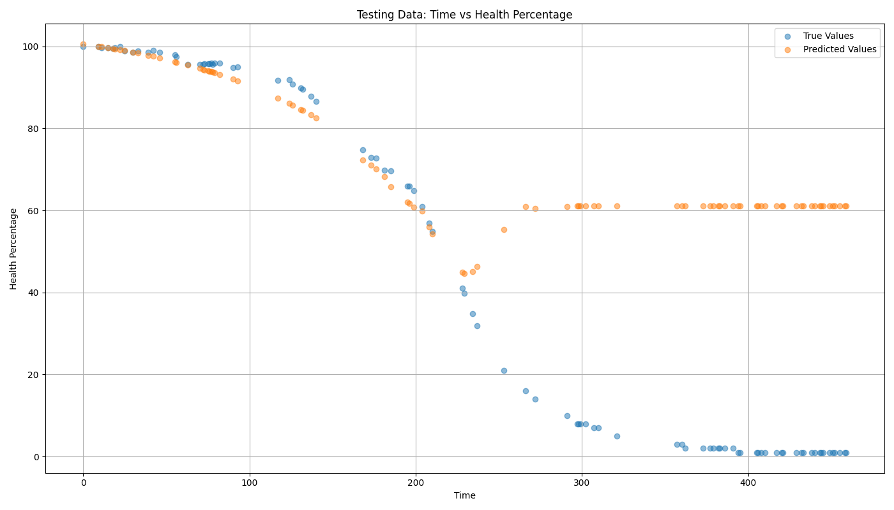

# RUL Experiments

## 16.06.2024

Still with sklearn, Support Vector Regression.

### Model trained with maintenace, tested on run-to-failure dataset

### Model trained with run-to-failure, tested on dataset with maintenance

## 15.06.2024

With sklearn, Support Vector Regression model:

### Run-to-failure

Training R^2: `0.9987058235956183`

Testing R^2: `0.9993135719482489`

### Simulating maintenance

Training R^2: `0.8436921735713233`

Testing R^2: `0.7575825125374217`

## 26.05.2024

With darts library, ExponentialSmoothing model:

### Run-to-failure

